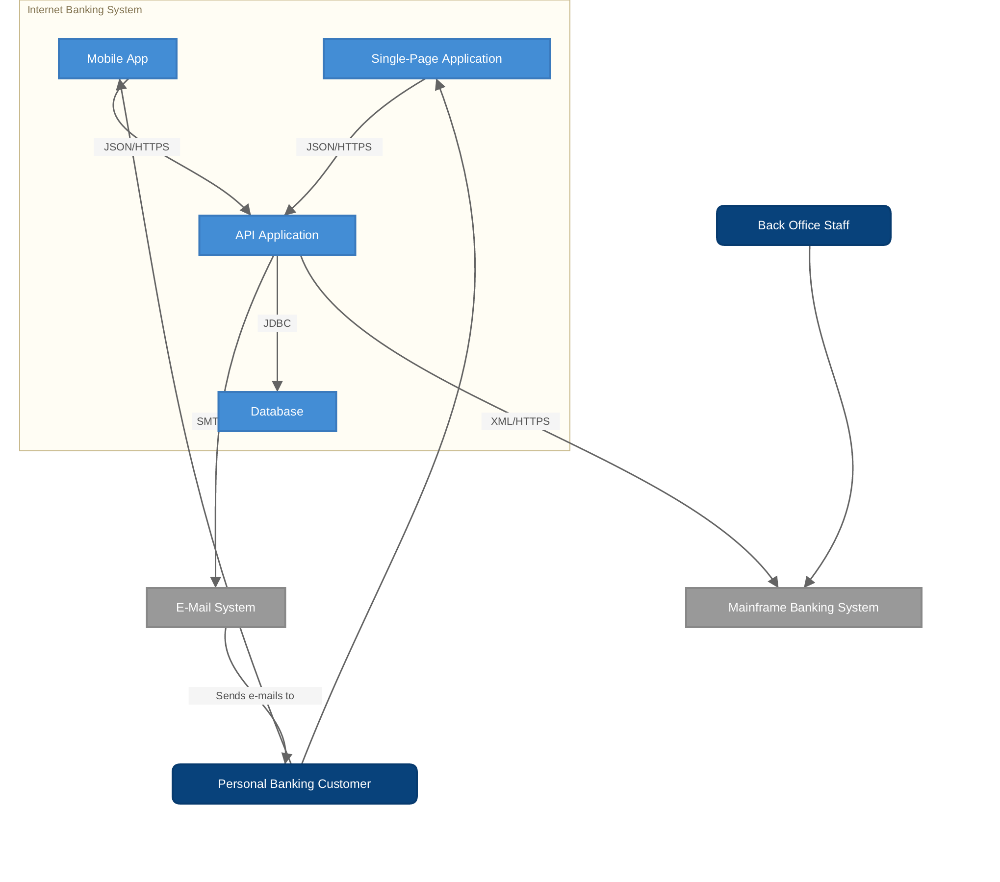
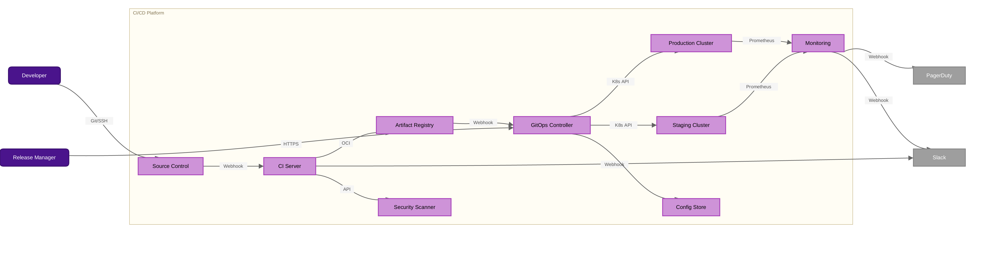
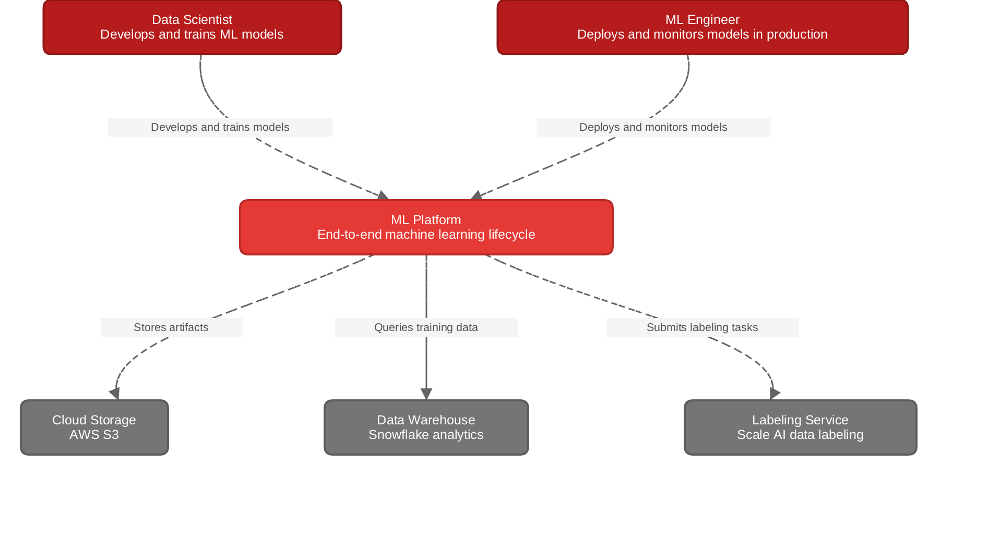
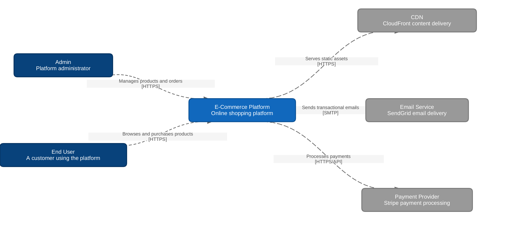

# boxcrab

<p align="center">
  
</p>

A native diagram viewer built in Rust. Renders Mermaid and Structurizr DSL files with crisp output at any zoom level -- no browser, no webview, no Electron.

## Features

- **Mermaid (.mmd)** and **Structurizr DSL (.dsl)** support
- Sugiyama layered graph layout with deterministic positioning
- Pan, zoom, and scroll navigation
- Live file-watching -- edits reload automatically
- C4 drill-down navigation with breadcrumb bar (Structurizr)
- PNG export at configurable scale
- File > Open dialog for loading new files
- Node shapes: rect, rounded, diamond, circle, flag
- Edge types: arrow, dotted, thick, bidirectional, with labels
- Subgraph grouping with titled boxes
- Per-node styles and class definitions

## Usage

Open a diagram in the viewer:

```sh
boxcrab diagram.mmd
boxcrab architecture.dsl
```

Export to PNG:

```sh
boxcrab --export output.png diagram.mmd
boxcrab --export output.png --scale 4 diagram.mmd
```

Select a specific view (Structurizr multi-view files):

```sh
boxcrab --view 1 architecture.dsl
```

### CLI flags

| Flag | Default | Description |
|---|---|---|
| `--export <path>` | | Export to PNG instead of opening viewer |
| `--scale <n>` | 2 | Scale factor for PNG export |
| `--view <n>` | 0 | View index for multi-view formats (0-based) |

## Examples

All examples below are rendered by boxcrab from files in [`test_diagrams/`](test_diagrams/).

### Mermaid: Banking System



### Mermaid: CI/CD Pipeline



### Mermaid: Microservices


### Structurizr DSL: ML Platform (System Context)



### Structurizr DSL: E-Commerce (System Context)



### Mermaid: Subgraphs and Styles


More examples in [`assets/img/examples/`](assets/img/examples/).

## Supported Formats

### Mermaid (.mmd)

Standard Mermaid flowchart/graph syntax including `graph`/`flowchart` declarations, all direction variants (TD, TB, LR, RL, BT), node shapes, edge types with labels, subgraphs, `style`, `classDef`, and `class` statements.

### Structurizr DSL (.dsl)

C4 model workspaces with system context, container, and component views. Supports `autoLayout` directives, element styles (shape, color, icon), relationship definitions, and interactive drill-down between view levels.

## Installing

Download a prebuilt binary from [GitHub Releases](https://github.com/jctanner/boxcrab/releases) for Linux (amd64/arm64), macOS (amd64/arm64), or Windows.

Or install from source:

```sh
cargo install --path .
```

## Building from source

```sh
git clone https://github.com/jctanner/boxcrab.git
cd boxcrab
cargo build --release
```

The binary will be at `target/release/boxcrab`.

## License

MIT
