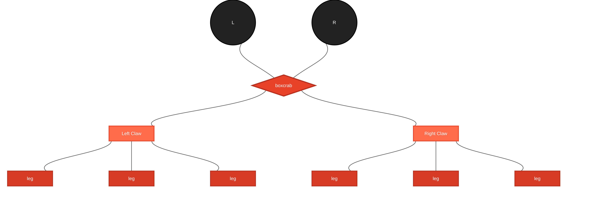
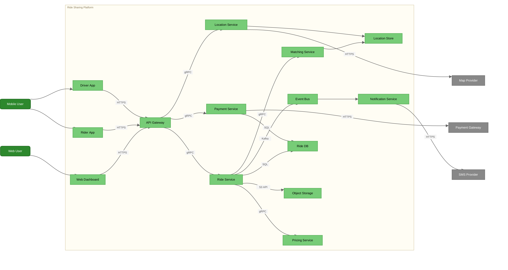
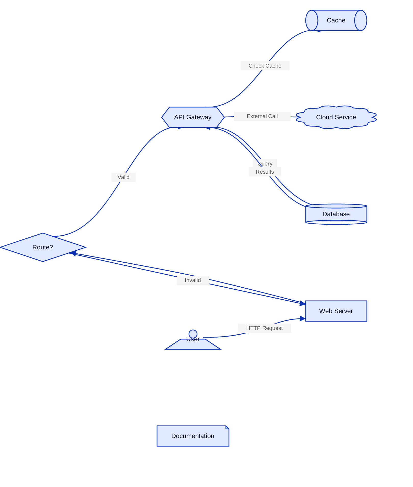
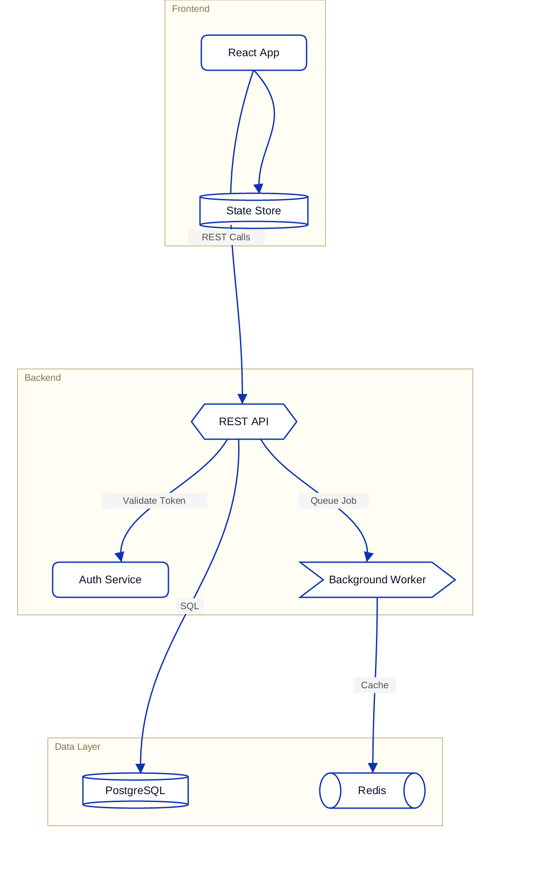
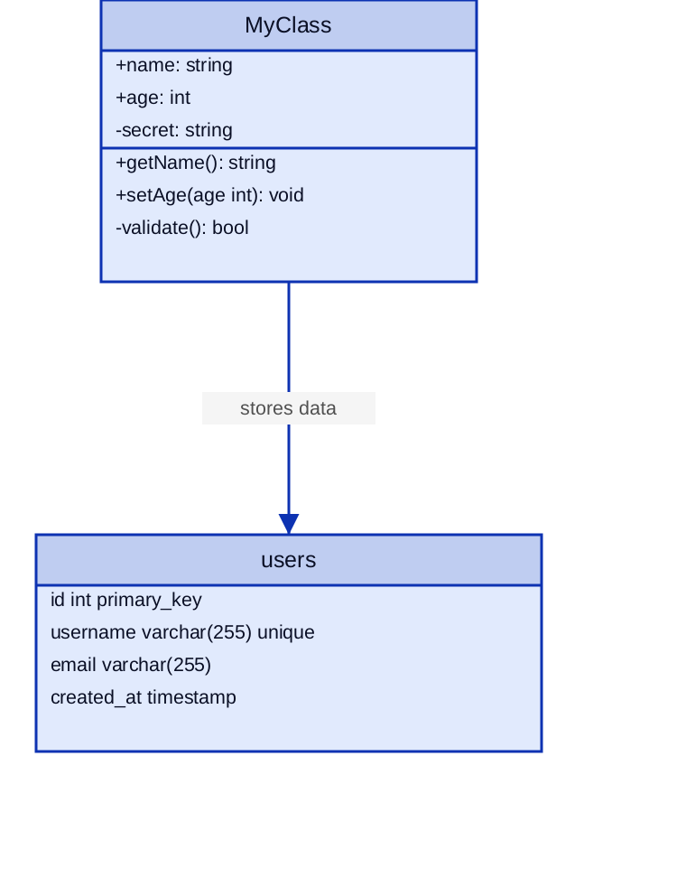
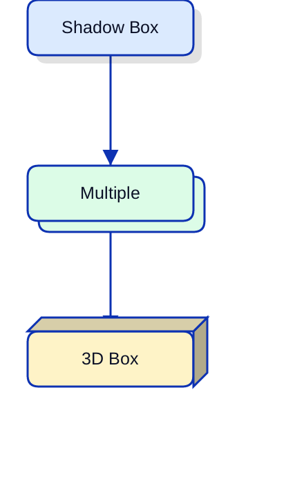
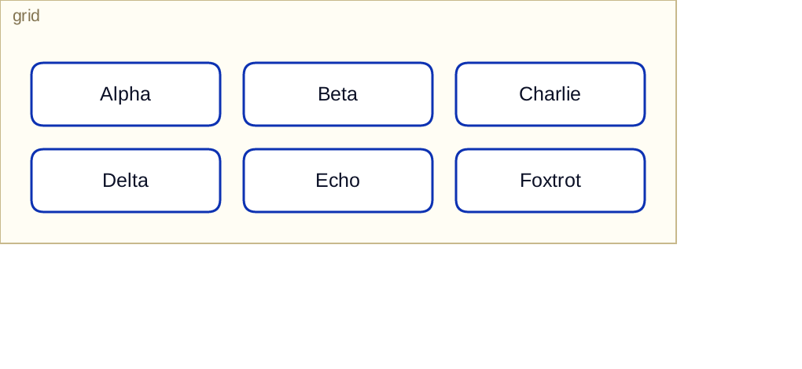
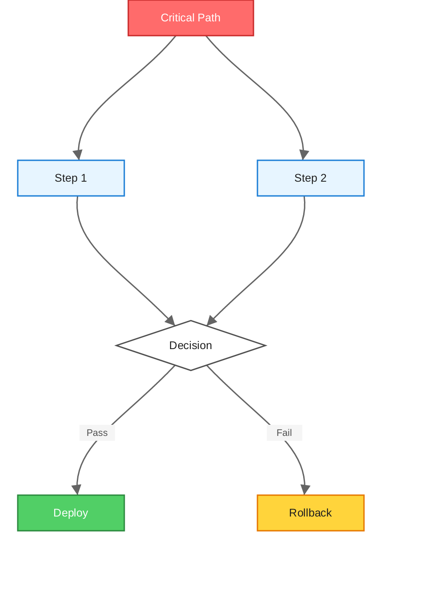

# boxcrab

<p align="center">
  
</p>

A native diagram viewer built in Rust. Renders Mermaid, Structurizr DSL, and D2 files with crisp output at any zoom level -- no browser, no webview, no Electron.

## Features

- **Mermaid (.mmd)**, **Structurizr DSL (.dsl)**, and **D2 (.d2)** support
- Sugiyama layered graph layout with deterministic positioning
- Pan, zoom, and scroll navigation
- Live file-watching -- edits reload automatically
- C4 drill-down navigation with breadcrumb bar (Structurizr)
- PNG export at configurable scale
- File > Open dialog for loading new files
- 20+ node shapes: rect, rounded, diamond, circle, flag, oval, hexagon, parallelogram, cylinder, cloud, page, document, person, queue, package, step, callout, stored data, class, SQL table
- Edge types: arrow, dotted, thick, bidirectional, with labels and 16 arrowhead variants
- Subgraph grouping with titled boxes and grid layout
- Per-node styles, class definitions, and theme system
- Visual effects: shadow, 3D depth, multiple (stacked)
- Fill patterns: dots, lines, grain, paper
- Tooltips on hover and clickable links (interactive mode)

## Usage

Open a diagram in the viewer:

```sh
boxcrab diagram.mmd
boxcrab architecture.dsl
boxcrab network.d2
```

Export to PNG:

```sh
boxcrab --export output.png diagram.mmd
boxcrab --export output.png --scale 4 diagram.mmd
```

Select a specific view (Structurizr multi-view files):

```sh
boxcrab --view 1 architecture.dsl
```

### CLI flags

| Flag | Default | Description |
|---|---|---|
| `--export <path>` | | Export to PNG instead of opening viewer |
| `--scale <n>` | 2 | Scale factor for PNG export |
| `--view <n>` | 0 | View index for multi-view formats (0-based) |

## Examples

All examples below are rendered by boxcrab from files in [`test_diagrams/`](test_diagrams/).

### Mermaid: Banking System


### Mermaid: CI/CD Pipeline


### Mermaid: Microservices



### Structurizr DSL: ML Platform (System Context)


### Structurizr DSL: E-Commerce (System Context)


### D2: Shapes and Connections



### D2: Containers



### D2: Class and SQL Table Diagrams



### D2: Visual Effects (Shadow, Multiple, 3D)



### D2: Grid Layout



### Mermaid: Subgraphs and Styles



More examples in [`test_diagrams/`](test_diagrams/).

## Supported Formats

### Mermaid (.mmd)

Standard Mermaid flowchart/graph syntax including `graph`/`flowchart` declarations, all direction variants (TD, TB, LR, RL, BT), node shapes, edge types with labels, subgraphs, `style`, `classDef`, and `class` statements.

### Structurizr DSL (.dsl)

C4 model workspaces with system context, container, and component views. Supports `autoLayout` directives, element styles (shape, color, icon), relationship definitions, and interactive drill-down between view levels.

### D2 (.d2)

D2 diagram language with shapes, connections, labels, and nested containers. Supports 20+ shape types, chained connections (`a -> b -> c`), 16 arrowhead variants, class and SQL table diagrams, `style` blocks (fill, stroke, opacity, border-radius, shadow, 3D, multiple, fill-pattern), `classes` definitions, theme system, `vars` with `${var}` substitution, file imports (`...@./path.d2`), grid layout, `near` positioning, tooltips, and clickable links.

## Installing

Download a prebuilt binary from [GitHub Releases](https://github.com/jctanner/boxcrab/releases) for Linux (amd64/arm64), macOS (amd64/arm64), or Windows.

Or install from source:

```sh
cargo install --path .
```

## Building from source

```sh
git clone https://github.com/jctanner/boxcrab.git
cd boxcrab
cargo build --release
```

The binary will be at `target/release/boxcrab`.

## License

MIT
