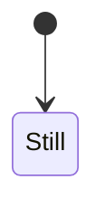

# Mermaid-CLI Specification

A language-agnostic specification of how `mermaid-cli` (`mmdc`) works internally,
derived from the reference implementation at `./references/mermaid-cli/` (v11.12.0).

---

## Table of Contents

1. [High-Level Architecture](#1-high-level-architecture)
2. [CLI Interface](#2-cli-interface)
3. [Input Handling](#3-input-handling)
4. [Configuration System](#4-configuration-system)
5. [Core Rendering Pipeline](#5-core-rendering-pipeline)
6. [HTML Template & Browser Environment](#6-html-template--browser-environment)
7. [Module Loading & Interception](#7-module-loading--interception)
8. [In-Browser Rendering Sequence](#8-in-browser-rendering-sequence)
9. [SVG Extraction](#9-svg-extraction)
10. [Output Format Conversion](#10-output-format-conversion)
11. [CSS Injection](#11-css-injection)
12. [Accessibility Metadata Extraction](#12-accessibility-metadata-extraction)
13. [Markdown Processing](#13-markdown-processing)
14. [Output File Naming](#14-output-file-naming)
15. [Error Handling](#15-error-handling)
16. [Stdin/Stdout Support](#16-stdinstdout-support)
17. [Icon Pack System](#17-icon-pack-system)
18. [Performance Characteristics](#18-performance-characteristics)
19. [File Format Signatures](#19-file-format-signatures)
20. [Programmatic API](#20-programmatic-api)
21. [Build System](#21-build-system)

---

## 1. High-Level Architecture

Mermaid-CLI is a command-line tool that converts mermaid diagram text definitions
into rendered images (SVG, PNG, PDF). It can also process Markdown files containing
embedded mermaid code blocks, replacing them with rendered image references.

The fundamental architecture is:

```
Input Text --> Headless Browser --> Mermaid JS Library --> DOM SVG --> Output Format
```

The tool does NOT implement its own diagram parser or renderer. Instead, it:

1. Launches a headless browser (Chromium via Puppeteer)
2. Loads a minimal HTML page with a container element
3. Dynamically imports the mermaid JavaScript library into the browser page
4. Calls `mermaid.render()` within the browser context to produce an SVG DOM element
5. Extracts the SVG from the DOM
6. Optionally converts to PNG (screenshot) or PDF (print-to-PDF)

This means the mermaid library runs in a real browser environment with full CSS,
font, and SVG support. The CLI is essentially an orchestration layer around
browser-based rendering.

### Component Relationships

```
cli.js          -- Entry point: parses args, validates, calls run()
index.js        -- Core engine: run(), renderMermaid(), markdown processing
puppeteerIntercept.js -- ESM module loading workaround for file:// URLs
index.html      -- Minimal HTML template loaded into the browser
dist/index.html -- Built version of index.html with CSS inlined as IIFE bundle
```

### Exported Functions

The tool exposes three functions for programmatic use:

- `cli()` -- Full CLI workflow (parse args, validate, render)
- `run(input, output, options)` -- High-level render (handles both .mmd and .md inputs)
- `renderMermaid(browser, definition, outputFormat, options)` -- Low-level single-diagram render

---

## 2. CLI Interface

### Command Name

`mmdc`

### Arguments

| Flag | Short | Type | Default | Description |
|------|-------|------|---------|-------------|
| `--theme` | `-t` | enum | `"default"` | Mermaid theme. One of: `default`, `forest`, `dark`, `neutral` |
| `--width` | `-w` | positive int | `800` | Browser viewport width in pixels |
| `--height` | `-H` | positive int | `600` | Browser viewport height in pixels |
| `--input` | `-i` | string | stdin | Input file path. `.md`/`.markdown` triggers markdown mode. `-` for stdin |
| `--output` | `-o` | string | `{input}.svg` | Output file path. Must end in `.svg`, `.png`, `.pdf`, `.md`, or `.markdown`. `-` for stdout |
| `--outputFormat` | `-e` | enum | from extension | Override output format: `svg`, `png`, `pdf` |
| `--backgroundColor` | `-b` | string | `"white"` | Background color. Supports CSS color names, hex (`#F0F0F0`), `transparent` |
| `--configFile` | `-c` | string | none | Path to JSON mermaid configuration file |
| `--cssFile` | `-C` | string | none | Path to CSS file to inject into SVG |
| `--svgId` | `-I` | string | `"my-svg"` | The `id` attribute for the rendered SVG element |
| `--scale` | `-s` | positive int | `1` | Browser device scale factor (DPI multiplier) |
| `--pdfFit` | `-f` | boolean | `false` | Scale PDF page dimensions to fit the chart |
| `--quiet` | `-q` | boolean | `false` | Suppress informational log output |
| `--puppeteerConfigFile` | `-p` | string | none | Path to JSON puppeteer launch configuration |
| `--iconPacks` | | string[] | `[]` | Iconify NPM package names (e.g. `@iconify-json/logos`) |
| `--iconPacksNamesAndUrls` | | string[] | `[]` | Custom icon packs as `name#url` pairs |
| `--artefacts` | `-a` | string | output dir | Output directory for extracted markdown diagram images |

### Argument Parsing Rules

- Integer arguments (`--width`, `--height`, `--scale`) must be positive integers (>= 1).
  Non-integer or non-positive values are rejected.
- `--theme` is constrained to exactly 4 values: `default`, `forest`, `dark`, `neutral`.
- `--outputFormat` is constrained to exactly 3 values: `svg`, `png`, `pdf`.

---

## 3. Input Handling

### Input Sources

There are three ways to provide input:

1. **File path** (`--input path/to/file.mmd`): Read from the specified file
2. **Explicit stdin** (`--input -`): Read from stdin, suppress the "no input" warning
3. **Implicit stdin** (no `--input` flag): Read from stdin, emit a warning

### Input Modes

The input mode is determined by the input file extension:

- **Mermaid mode** (`.mmd` or any non-markdown extension, or stdin): The entire input
  is treated as a single mermaid diagram definition
- **Markdown mode** (`.md` or `.markdown`): The input is scanned for embedded mermaid
  code blocks, each rendered individually

### Stdin Reading

When reading from stdin, the tool:

1. Reads chunks as they become available
2. Concatenates all chunks into a single string
3. Resolves when stdin closes (EOF)
4. Rejects on stream error

Stdin input is always treated as mermaid mode (never markdown mode), since there
is no file extension to detect.

---

## 4. Configuration System

### Mermaid Configuration

Mermaid configuration is built by merging layers in this order (later wins):

1. **Base**: `{ theme: <--theme value> }`
2. **Config file overlay**: If `--configFile` is provided, parse it as JSON and merge

The merged config is passed to `mermaid.initialize()` with `startOnLoad: false` prepended
(which the config file can override if needed, though `startOnLoad` should always be
`false` since rendering is triggered manually).

Example config file:
```json
{
  "startOnLoad": true,
  "flowchart": {
    "useMaxWidth": false,
    "htmlLabels": true
  },
  "sequence": {
    "height": 40,
    "actorMargin": 80,
    "mirrorActors": false,
    "bottomMarginAdj": 1
  },
  "theme": "forest",
  "themeCSS": ".node rect { fill: white; }"
}
```

Special config options:
- `deterministicIds: true` -- Produces reproducible SVG element IDs
- `themeCSS` -- CSS injected by mermaid itself during rendering (distinct from `--cssFile`)

### Puppeteer Configuration

Puppeteer configuration starts with:
```json
{ "headless": "shell" }
```

If `--puppeteerConfigFile` is provided, its contents are merged on top. This allows
setting browser args, executable path, timeout, viewport, etc.

Example (used in negative tests to force timeout):
```json
{ "timeout": 1 }
```

### Viewport Configuration

The viewport passed to the browser is constructed as:
```
{
  width: <--width>,
  height: <--height>,
  deviceScaleFactor: <--scale>
}
```

This is only set if viewport values are provided. The viewport affects the initial
rendering canvas size and the DPI of PNG screenshots.

---

## 5. Core Rendering Pipeline

### Single Diagram (`run()` for .mmd input)

```
1. Read input text from file or stdin
2. Determine output format from file extension or --outputFormat flag
3. Launch headless browser with puppeteer config
4. Call renderMermaid(browser, definition, outputFormat, options)
5. Write output bytes to file or stdout
6. Close browser
```

### Markdown File (`run()` for .md input)

```
1. Read entire markdown file
2. Determine output format (default: svg for .md output)
3. Find all mermaid code blocks via regex
4. For each match:
   a. Launch browser (lazily, only once, reused across diagrams)
   b. Extract mermaid definition from the code block
   c. Generate numbered output filename
   d. Call renderMermaid() -- all diagrams rendered in parallel
   e. Write image file to disk
5. Await all parallel renders
6. If output is .md/.markdown:
   a. Replace each mermaid code block with a markdown image reference
   b. Use title/description metadata from SVG accessibility elements
   c. Write transformed markdown file
7. Close browser
```

### renderMermaid() Pipeline

This is the core rendering function. Its steps in detail:

```
1.  Create new browser page
2.  Attach console warning handler (browser console.warn -> stderr)
3.  Set viewport if provided
4.  Navigate to the HTML template (dist/index.html)
5.  Set body background color
6.  Set up ESM module interception (Interceptor)
7.  Convert file:// URLs for mermaid/elk/zenuml to interceptable URLs
8.  Enable request interception on the page
9.  Execute in-browser rendering script (page.$eval on #container):
    a.  Import mermaid, elk layouts, zenuml via intercepted URLs
    b.  Wait for all document fonts to load
    c.  Register external diagrams (zenuml)
    d.  Register layout loaders (elk)
    e.  Register icon packs (lazy-loaded)
    f.  Initialize mermaid with merged config
    g.  Call mermaid.render(svgId, definition, container)
    h.  Insert rendered SVG HTML into container
    i.  Set SVG background color
    j.  Inject custom CSS as SVG <style> element
    k.  Extract title/description metadata from SVG
    l.  Return metadata
10. Extract output based on format:
    - SVG: serialize DOM SVG element to XML string
    - PNG: get SVG bounding box, resize viewport, take clipped screenshot
    - PDF: optionally fit page to SVG bounds, generate PDF
11. Close page
12. Return { title, desc, data: Uint8Array }
```

---

## 6. HTML Template & Browser Environment

### Template Structure

The HTML template is minimal:

```html
<!doctype html>
<html>
  <body>
    <div id="container"></div>
    <script type="module">
      import "@fortawesome/fontawesome-free/css/brands.css"
      import "@fortawesome/fontawesome-free/css/regular.css"
      import "@fortawesome/fontawesome-free/css/solid.css"
      import "@fortawesome/fontawesome-free/css/fontawesome.css"
      import "katex/dist/katex.css"
    </script>
  </body>
</html>
```

Key aspects:
- Single `<div id="container">` where mermaid renders into
- FontAwesome CSS (brands, regular, solid, fontawesome) for icon support in diagrams
- KaTeX CSS for mathematical formula rendering support
- No mermaid library loaded here -- it's imported dynamically during rendering

### Build Process

The template is built by Vite into `dist/index.html`:
- All CSS imports are bundled and inlined
- The `<script type="module">` is converted to a plain `<script>` (IIFE format)
- This makes the dist HTML self-contained -- no external file dependencies for CSS

The built HTML file is what gets loaded into the browser at runtime.

---

## 7. Module Loading & Interception

### The Problem

Browsers running in headless mode (Puppeteer) cannot load ES modules from `file://`
URLs due to CORS restrictions. The mermaid library, ELK layout engine, and ZenUML
diagram support are all distributed as ESM bundles.

### The Solution

An HTTP request interception layer that:

1. Maps `file://` URLs to a fake HTTPS origin: `https://mermaid-cli-intercept.invalid`
2. Intercepts browser HTTP requests to that origin
3. Reads the actual file content and responds as if it were an HTTP response

### Interceptor Lifecycle

```
1. Create Interceptor instance
2. For each ESM module (mermaid, elk, zenuml):
   a. Resolve the module's file path on disk
   b. Call interceptor.fileUrlToInterceptUrl(fileURL)
      - Records the file's directory in an allowed-directories set
      - Returns https://mermaid-cli-intercept.invalid/{path}
3. Register interceptor.interceptRequestHandler on the page's 'request' event
4. Enable request interception: page.setRequestInterception(true)
5. When the browser tries to import(interceptUrl):
   a. Handler checks if URL starts with the intercept origin
   b. If yes: read file from disk, respond with application/javascript content-type
      and CORS header (Access-Control-Allow-Origin: *)
   c. If no: pass the request through unchanged (request.continue())
```

### Security

The interceptor maintains a set of allowed directories. When converting an intercept
URL back to a file URL, it verifies the resolved path is within an allowed directory.
This prevents path traversal attacks where a crafted URL could read arbitrary files.

The path traversal check uses `realpath` to resolve symlinks before comparison.

### Modules Intercepted

| Module | ESM File | Purpose |
|--------|----------|---------|
| mermaid | `mermaid.esm.mjs` | Core diagram rendering engine |
| layout-elk | `mermaid-layout-elk.esm.mjs` | ELK graph layout algorithm |
| mermaid-zenuml | `mermaid-zenuml.esm.mjs` | ZenUML sequence diagram support |

Each module is resolved from the installed node_modules using import-meta-resolve,
then the ESM bundle path is constructed by finding the `.esm.mjs` file in the same
directory as the resolved entry point.

---

## 8. In-Browser Rendering Sequence

This is what happens inside the browser context (within `page.$eval`). This runs
in the Chromium JavaScript environment, not in the host process.

### Step 1: Import Libraries

```
const { default: mermaid } = await import(mermaidUrl)
const { default: elkLayouts } = await import(elkUrl)
const { default: zenuml } = await import(zenumlUrl)
```

Dynamic ESM imports via the intercepted URLs. The browser fetches from
`https://mermaid-cli-intercept.invalid/...` which the interceptor serves from disk.

### Step 2: Wait for Fonts

```
await Promise.all(Array.from(document.fonts, (font) => font.load()))
```

Ensures all declared fonts (FontAwesome, KaTeX) are fully loaded before rendering.
This prevents diagrams from being rendered with missing icon glyphs.

### Step 3: Register Extensions

```
await mermaid.registerExternalDiagrams([zenuml])
mermaid.registerLayoutLoaders(elkLayouts)
```

- **ZenUML**: Registers as an external diagram type, enabling `zenuml` code blocks
- **ELK**: Registers as a layout algorithm, enabling `layout: elk` in diagram config

### Step 4: Register Icon Packs

Icon packs are registered with lazy loaders that fetch JSON from URLs on demand:

```
mermaid.registerIconPacks([{
  name: "logos",       // extracted from package name: @iconify-json/logos -> "logos"
  loader: () => fetch("https://unpkg.com/@iconify-json/logos/icons.json").then(r => r.json())
}])
```

For named icon packs (`name#url` format):
```
mermaid.registerIconPacks([{
  name: "azure",       // part before #
  loader: () => fetch("https://raw.githubusercontent.com/.../icons.json").then(r => r.json())
}])
```

Icon packs are NOT fetched at registration time -- only when a diagram actually
references an icon from that pack.

### Step 5: Initialize Mermaid

```
mermaid.initialize({ startOnLoad: false, ...mermaidConfig })
```

`startOnLoad: false` is critical -- it prevents mermaid from automatically scanning
the page for diagram elements. Rendering is triggered explicitly in the next step.

### Step 6: Render Diagram

```
const { svg: svgText } = await mermaid.render(svgId || 'my-svg', definition, container)
container.innerHTML = svgText
```

`mermaid.render()` takes:
- `svgId`: The `id` attribute for the generated `<svg>` element (default: `"my-svg"`)
- `definition`: The mermaid diagram text
- `container`: A DOM element used as rendering context

It returns `{ svg: string }` where `svg` is the SVG markup as an HTML string.

The SVG string is then inserted into the container element via `innerHTML`.

If the definition has a syntax error, `mermaid.render()` throws an error with
a parse error message.

### Step 7: Apply Background Color

```
const svg = container.getElementsByTagName('svg')[0]
if (svg?.style) {
  svg.style.backgroundColor = backgroundColor
}
```

Sets the background color directly on the SVG element's inline style.

### Step 8: Inject Custom CSS (if provided)

```
const style = document.createElementNS('http://www.w3.org/2000/svg', 'style')
style.appendChild(document.createTextNode(myCSS))
svg.appendChild(style)
```

Custom CSS is added as an SVG `<style>` element inside the SVG root. This uses
the SVG namespace (`http://www.w3.org/2000/svg`), not the HTML namespace.

### Step 9: Extract Metadata

```
let title = null
if (svg.firstChild instanceof SVGTitleElement) {
  title = svg.firstChild.textContent
}

let desc = null
for (const svgNode of svg.children) {
  if (svgNode instanceof SVGDescElement) {
    desc = svgNode.textContent
  }
}
```

Per SVG specification:
- `<title>` must be the first child element of `<svg>` if present
- `<desc>` can appear anywhere; the first one found is used

These come from mermaid's `accTitle` and `accDescr` directives in the diagram source:
```
graph TD
    accTitle: My Diagram Title
    accDescr: A description of my diagram
    A --> B
```

---

## 9. SVG Extraction

When the output format is SVG, the rendered SVG DOM element is serialized to XML:

```
const xmlSerializer = new XMLSerializer()
return xmlSerializer.serializeToString(svg)
```

### Why XMLSerializer?

Mermaid diagrams can contain HTML `<foreignObject>` elements (used for rich text
labels with `htmlLabels: true`). These contain HTML elements like `<br>` which are
valid HTML but not valid XML (XML requires `<br/>`). `XMLSerializer` handles this
conversion automatically.

### Output

The serialized XML string is encoded to UTF-8 bytes and returned alongside metadata.

---

## 10. Output Format Conversion

### SVG Output

1. Serialize SVG DOM to XML string (see above)
2. Encode as UTF-8 bytes
3. Return `{ title, desc, data: Uint8Array }`

### PNG Output

1. Query SVG bounding box: `svg.getBoundingClientRect()`
2. Compute clip region with pixel-perfect boundaries:
   ```
   clip = {
     x: floor(boundingRect.left),
     y: floor(boundingRect.top),
     width: ceil(boundingRect.width),
     height: ceil(boundingRect.height)
   }
   ```
3. Resize viewport to encompass the full clip region:
   ```
   viewport.width = clip.x + clip.width
   viewport.height = clip.y + clip.height
   ```
4. Take a clipped screenshot:
   ```
   page.screenshot({
     clip: clip,
     omitBackground: (backgroundColor === 'transparent')
   })
   ```
5. Return PNG bytes as `Uint8Array`

The `omitBackground` flag removes the browser's default white background, enabling
true transparency in PNG output.

The `deviceScaleFactor` from `--scale` affects the pixel density of the screenshot
(e.g., scale=2 produces a 2x resolution image).

### PDF Output

Two modes based on `--pdfFit`:

**Without --pdfFit (default):**
```
page.pdf({
  omitBackground: (backgroundColor === 'transparent')
})
```
Uses the browser's default page dimensions (typically US Letter: 8.5" x 11").
The SVG is rendered at its natural size on the page.

**With --pdfFit:**
1. Query SVG bounding box: `svg.getBoundingClientRect()`
2. Set page dimensions to fit the SVG with padding:
   ```
   width = ceil(boundingRect.width) + (boundingRect.left * 2)    // px
   height = ceil(boundingRect.height) + (boundingRect.top * 2)   // px
   ```
3. Render single-page PDF:
   ```
   page.pdf({
     omitBackground: (backgroundColor === 'transparent'),
     width: width + 'px',
     height: height + 'px',
     pageRanges: '1-1'
   })
   ```

The padding (`x * 2` and `y * 2`) creates equal margins around the diagram by
using the diagram's position offset from the page origin.

---

## 11. CSS Injection

There are two independent CSS injection mechanisms:

### 1. External CSS File (`--cssFile`)

- Read from disk as UTF-8 text
- Injected into the SVG as an `<style>` element using the SVG namespace
- Applied **after** mermaid renders the diagram
- Appended as the last child of the `<svg>` root element
- Can use `!important` to override mermaid's theme CSS

### 2. Theme CSS (via config `themeCSS`)

- Specified in the mermaid config JSON file
- Applied **by mermaid itself** during rendering
- Part of the theme system, processed before the diagram is generated

### CSS Priority

The external CSS file takes precedence over theme CSS because it is injected
after rendering. However, mermaid's inline styles may still win specificity battles
unless `!important` is used.

### Example CSS

```css
.flowchart-link {
  animation: dash 30s linear infinite;
}
.label {
  font-family: "fantasy" !important;
}
@keyframes dash {
  0% { stroke-dashoffset: 1000; }
  100% { }
}
```

---

## 12. Accessibility Metadata Extraction

After rendering, the tool extracts accessibility metadata from the SVG:

### Title

Per SVG 1.1 specification, `<title>` must be the first child of `<svg>` if present.
The tool checks `svg.firstChild` and extracts `textContent` if it is an SVGTitleElement.

### Description

The tool iterates all direct children of `<svg>` looking for the first `<desc>`
element and extracts its `textContent`.

### Source

These metadata elements are generated by mermaid from the `accTitle` and `accDescr`
directives in the diagram definition:



### Usage

The metadata is used when generating markdown image references in markdown mode:

```markdown

```

- `title` becomes the markdown image title (in quotes)
- `desc` becomes the markdown image alt text
- Default alt text is `"diagram"` when no description is present

---

## 13. Markdown Processing

### Regex Pattern

Mermaid code blocks in markdown are detected with this regex:

```
/^[^\S\n]*[`:]{3}(?:mermaid)([^\S\n]*\r?\n([\s\S]*?))[`:]{3}[^\S\n]*$/gm
```

Breaking it down:

| Part | Meaning |
|------|---------|
| `^` | Start of line (multiline mode) |
| `[^\S\n]*` | Optional leading whitespace (spaces/tabs, not newlines) |
| `` [`:]{3} `` | Three backticks OR three colons |
| `(?:mermaid)` | Literal "mermaid" |
| `[^\S\n]*` | Optional trailing whitespace after "mermaid" |
| `\r?\n` | Newline (supports both LF and CRLF) |
| `([\s\S]*?)` | Diagram body (lazy match, capture group 2) |
| `` [`:]{3} `` | Three closing backticks OR three colons |
| `[^\S\n]*` | Optional trailing whitespace |
| `$` | End of line (multiline mode) |

### What It Matches

```markdown

```

```markdown
:::mermaid
graph TD
    A --> B
:::
```

Also handles:
- Indented code blocks (leading spaces/tabs)
- Trailing spaces after opening `` ```mermaid `` and closing `` ``` ``
- CRLF line endings

### What It Does NOT Match

- Stdin input (no file extension to detect markdown mode)
- Code blocks with language identifiers other than "mermaid"
- Nested code blocks

### Markdown Output Transformation

When the output is `.md`/`.markdown`, each mermaid code block is replaced with
a markdown image reference:

```markdown

```

The replacement uses the `markdownImage()` function with proper escaping:
- Alt text: `[`, `]`, `\` are escaped with backslash
- Title text: `"`, `\` are escaped with backslash

Image paths are computed as relative paths from the output markdown file's
directory to the image file's location.

### Empty Markdown

If a markdown file contains no mermaid code blocks, the tool logs
"No mermaid charts found in Markdown input" and writes the markdown unchanged
(if output is .md) or produces no image files.

---

## 14. Output File Naming

### Single Diagram (.mmd input)

| Input | Output Flag | Result |
|-------|-------------|--------|
| `diagram.mmd` | none | `diagram.mmd.svg` |
| `diagram.mmd` | `-o out.png` | `out.png` |
| `diagram.mmd` | `-e pdf` | `diagram.mmd.pdf` |
| none (stdin) | none | `out.svg` |
| none (stdin) | `-e png` | `out.png` |

### Markdown Diagrams (.md input)

Each extracted diagram gets a numbered filename based on the output path:

| Output Path | Diagram Images |
|-------------|----------------|
| `out.svg` | `out-1.svg`, `out-2.svg`, ... |
| `out.png` | `out-1.png`, `out-2.png`, ... |
| `out.md` | `out-1.svg`, `out-2.svg`, ... (default SVG) |
| `out.md` with `-e png` | `out-1.png`, `out-2.png`, ... |

The numbering is 1-based and sequential.

When `--artefacts` is specified, image files are placed in that directory
instead of alongside the output file. The artefacts directory is created
recursively if it doesn't exist.

### Output Format Inference

The output format is determined in priority order:

1. `--outputFormat` flag (explicit)
2. Output file extension (`.svg`, `.png`, `.pdf`)
3. For `.md`/`.markdown` output: defaults to `svg`
4. For stdout output without format: defaults to `svg` with warning
5. For no output specified: defaults to `svg`

---

## 15. Error Handling

### Fatal Errors (exit code 1)

| Condition | Message |
|-----------|---------|
| Input file doesn't exist | `Input file "{path}" doesn't exist` |
| Output directory doesn't exist | `Output directory "{path}/" doesn't exist` |
| Config file doesn't exist | `Configuration file "{path}" doesn't exist` |
| CSS file doesn't exist | `CSS file "{path}" doesn't exist` |
| Invalid output extension | `Output file must end with ".md"/".markdown", ".svg", ".png" or ".pdf"` |
| Invalid output format | `Output format must be one of "svg", "png" or "pdf"` |
| Artefacts with non-markdown input | `Artefacts [-a\|--artefacts] path can only be used with Markdown input file` |
| Markdown input to stdout | `Cannot use 'stdout' with markdown input` |
| Invalid mermaid syntax | Parse error from mermaid.render() (propagated from browser) |
| Browser timeout | Puppeteer TimeoutError (propagated) |
| Invalid integer argument | `Not a positive integer.` |

### Warnings (stderr, non-fatal)

| Condition | Message |
|-----------|---------|
| No `--input` flag | `No input file specified, reading from stdin...` |
| Stdout without `--outputFormat` | `No output format specified, using svg...` |
| SVG element not found after render | `svg not found. Not applying background color.` |
| Browser console messages | Forwarded to stderr |

### Error Propagation

Mermaid parse errors are thrown as exceptions within the browser context via
`mermaid.render()` and propagate up through Puppeteer's `page.$eval()` to the
host process. The error message includes line/column information.

Example error for invalid syntax:
```
Error: Parse error on line 2:
```

### Cleanup

The browser is always closed in a `finally` block, even when errors occur.
Individual pages are also closed in `finally` blocks within `renderMermaid()`.

---

## 16. Stdin/Stdout Support

### Stdin Input

- Triggered by `--input -` or omitting `--input` entirely
- Reads all data until EOF, concatenates into a single string
- Always treated as mermaid mode (never markdown)
- With `-`: no warning emitted
- Without flag: warning emitted about missing input file

### Stdout Output

- Triggered by `--output -` (internally maps to `/dev/stdout`)
- Forces `--quiet` mode (suppresses log output to avoid corrupting the binary stream)
- Requires `--outputFormat` or defaults to SVG with a warning
- Cannot be used with markdown input (throws error)
- Output bytes written directly to the stdout stream

---

## 17. Icon Pack System

### Iconify NPM Packages (`--iconPacks`)

Format: `@iconify-json/{name}`

The icon pack name is extracted by splitting on `/` and taking the second element.
At render time, when a diagram references an icon from this pack, the JSON is fetched
from `https://unpkg.com/{package}/icons.json`.

Example:
- Package: `@iconify-json/logos`
- Name: `logos`
- Fetch URL: `https://unpkg.com/@iconify-json/logos/icons.json`
- Usage in diagram: `group aws(logos:aws)[AWS]`

### Custom Icon Packs (`--iconPacksNamesAndUrls`)

Format: `name#url`

The name is the part before `#`, the URL is the part after `#`.

Example:
- Input: `azure#https://raw.githubusercontent.com/.../icons.json`
- Name: `azure`
- Fetch URL: `https://raw.githubusercontent.com/.../icons.json`
- Usage in diagram: `resource-groups@{ icon: "azure:resource-groups" }`

### Lazy Loading

Icon packs are NOT fetched when registered. A loader function is registered that
fetches the JSON on first use. If a diagram doesn't reference any icons from a
pack, it is never fetched.

### Icon JSON Format

Expected format: Iconify JSON (https://iconify.design/docs/icons/json.html)

---

## 18. Performance Characteristics

### Browser Reuse

- **Single diagram**: One browser instance, one page, closed after render
- **Markdown with N diagrams**: One browser instance, N pages created sequentially,
  all renders run in parallel via `Promise.all()`, browser closed after all complete

### Lazy Browser Launch

The browser is only launched when at least one diagram needs rendering. For a
markdown file with no mermaid blocks, no browser is launched at all.

### Headless Shell Mode

Uses `headless: 'shell'` mode which, in Puppeteer v22+, uses the faster
`chrome-headless-shell` binary instead of full headless Chrome.

### Parallel Rendering

All mermaid diagrams within a markdown file are rendered in parallel. Each gets
its own browser page, but they share the same browser instance. This means
N diagram renders start concurrently, with the main bottleneck being the
browser's per-page resource allocation.

---

## 19. File Format Signatures

Output files can be validated by their magic bytes:

| Format | Signature Bytes | ASCII |
|--------|----------------|-------|
| PNG | `89 50 4E 47 0D 0A 1A 0A` | `.PNG....` |
| PDF | `25 50 44 46 2D` | `%PDF-` |
| SVG | `3C 73 76 67` | `<svg` |

---

## 20. Programmatic API

The tool exports functions for use as a library:

### `renderMermaid(browser, definition, outputFormat, options?)`

Low-level render. Requires a pre-existing Puppeteer browser instance.

**Parameters:**
- `browser`: Puppeteer Browser or BrowserContext
- `definition`: string -- mermaid diagram text
- `outputFormat`: `"svg"` | `"png"` | `"pdf"`
- `options`: object (all optional)
  - `viewport`: `{ width, height, deviceScaleFactor }`
  - `backgroundColor`: string (default: `"white"`)
  - `mermaidConfig`: object (default: `{}`)
  - `myCSS`: string -- CSS text to inject
  - `pdfFit`: boolean
  - `svgId`: string -- SVG element id
  - `iconPacks`: string[]
  - `iconPacksNamesAndUrls`: string[]

**Returns:** `Promise<{ title: string|null, desc: string|null, data: Uint8Array }>`

### `run(input, output, options?)`

High-level render. Manages its own browser lifecycle.

**Parameters:**
- `input`: string | undefined -- file path, or undefined for stdin
- `output`: string -- output file path or `"/dev/stdout"`
- `options`: object (all optional)
  - `puppeteerConfig`: Puppeteer launch options
  - `quiet`: boolean
  - `outputFormat`: `"svg"` | `"png"` | `"pdf"`
  - `parseMMDOptions`: same as renderMermaid options
  - `artefacts`: string -- artefacts directory path

### `cli()`

Full CLI entrypoint. Parses `process.argv`, validates, calls `run()`.

---

## 21. Build System

### Vite Configuration

The build uses Vite to bundle `index.html` into `dist/index.html`:

1. **IIFE conversion**: A custom Vite plugin converts ES module output to IIFE
   (Immediately Invoked Function Expression) format, since the HTML template
   needs to work in the headless browser without module support
2. **Script tag transformation**: `<script type="module" crossorigin>` is replaced
   with `<script charset="utf-8">`
3. **CSS inlining**: All imported CSS (FontAwesome, KaTeX) is bundled into the
   HTML file
4. **Base path**: Set to `./` for relative asset resolution

### Build Commands

- `vite build`: Produces `dist/index.html`
- `tsc`: Type-checks the source (output to `dist-types/`)
- Both run during `prepare` and `prepack` lifecycle hooks

---

## Appendix A: Complete Data Flow Diagram

```
User Input
    |
    v
[CLI Argument Parsing]
    |
    +--> Validate input file exists
    +--> Validate output directory exists
    +--> Validate config/css files exist
    +--> Determine output format
    +--> Merge mermaid config (theme + configFile)
    +--> Read CSS file if specified
    |
    v
[run()]
    |
    +--> Is input .md/.markdown?
    |       |
    |       YES --> [Markdown Processing]
    |       |       |
    |       |       +--> Regex scan for mermaid blocks
    |       |       +--> For each block:
    |       |       |       +--> Generate numbered output filename
    |       |       |       +--> [renderMermaid()] (in parallel)
    |       |       |       +--> Write image file
    |       |       |
    |       |       +--> If output is .md:
    |       |               +--> Replace blocks with 
    |       |               +--> Write output markdown
    |       |
    |       NO --> [Single Diagram]
    |               |
    |               +--> Read definition from file/stdin
    |               +--> [renderMermaid()]
    |               +--> Write to file/stdout
    |
    v
[renderMermaid()]
    |
    +--> Create browser page
    +--> Set viewport
    +--> Navigate to dist/index.html
    +--> Set body background color
    +--> Setup ESM module interception
    |
    +--> [In-Browser Execution]
    |       |
    |       +--> Import mermaid, elk, zenuml
    |       +--> Load fonts
    |       +--> Register extensions & icon packs
    |       +--> mermaid.initialize(config)
    |       +--> mermaid.render(svgId, definition)
    |       +--> Insert SVG into container
    |       +--> Apply background color
    |       +--> Inject custom CSS
    |       +--> Extract title/desc metadata
    |
    +--> [Output Extraction]
            |
            +--> SVG? --> XMLSerializer.serializeToString(svg)
            +--> PNG? --> getBoundingClientRect() --> resize viewport --> screenshot(clip)
            +--> PDF? --> pdfFit? getBoundingClientRect() --> pdf(width, height) : pdf()
            |
            v
        { title, desc, data: Uint8Array }
```

## Appendix B: Porting Considerations

When porting to another language, the key architectural question is how to
replace the headless browser. The browser provides:

1. **A JavaScript runtime** -- mermaid is a JavaScript library
2. **A full DOM** -- SVG rendering requires DOM APIs
3. **CSS layout engine** -- for computing element positions
4. **Font rendering** -- for measuring text
5. **SVG rendering** -- for computing bounding boxes and rasterization

Options for porting:

- **Keep using a headless browser**: Use Chromium/WebKit bindings for the target
  language (e.g., `headless_chrome` crate for Rust). This preserves pixel-perfect
  compatibility but requires Chromium as a dependency.
- **Use a JS runtime without a browser**: e.g., embed V8 or Deno. Would need a
  virtual DOM (jsdom-like) for mermaid to render into.
- **Native SVG rendering**: Parse mermaid's SVG output with an SVG library and
  rasterize natively. Still need the browser/JS for the mermaid.render() step
  unless you reimplement the mermaid parser.
- **Reimplement mermaid**: Parse the mermaid DSL natively and generate SVG directly.
  This is the most work but eliminates all browser/JS dependencies.

The markdown processing, CLI argument handling, file I/O, and output format
conversion are all straightforward to port. The browser-based rendering pipeline
is the only part that has deep JavaScript/browser dependencies.
